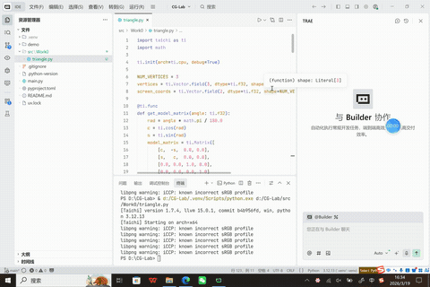

# Triangle 三角形效果展示

- 占博文 202411081043 人工智能

## 效果演示

## 一、项目简介
本项目为计算机图形学核心基础实验，基于 Python 手写三角形扫描线光栅化算法。不调用内置图形填充接口，完全通过底层数学运算实现三角形边界判定、像素采样、颜色渐变插值，完整复刻现代图形渲染最核心的「光栅化」流程，是理解 2D/3D 图形渲染管线的入门必备实验。
## 二、项目目录结构
Triangle/
├── src/Work0/                # 核心实验源码目录
├── main.py                   # 程序入口、渲染主函数
├── Triangle.gif              # 项目效果演示动图
├── .gitignore                # 忽略虚拟环境、缓存文件
├── .python-version           # Python 版本锁定
├── pyproject.toml            # 项目依赖配置
├── uv.lock                   # 依赖版本锁定文件
└── README.md                 # 项目说明文档
## 三、运行环境与依赖
- Python 版本：3.10+
- 环境说明：本地虚拟环境 .venv 已忽略，不提交仓库
- 依赖管理：支持 uv / pip 安装依赖
## 四、运行指令
项目根目录直接运行：
python main.py
## 五、核心算法原理
1. 光栅化基本概念
光栅化是计算机图形学的核心基础流程：将数学坐标系中连续的几何三角形，通过算法离散为屏幕上一个个独立像素，判断像素内外归属并填充颜色，是所有游戏、动画、三维渲染的底层基础。
2. 扫描线填充算法（核心）
本项目采用行业标准扫描线填充算法实现实心三角形绘制，流程如下：
步骤1：顶点排序
对三角形三个顶点按 Y 轴纵坐标从小到大排序，区分最低点、中点、最高点，统一扫描逻辑，避免图形绘制错乱。
步骤2：边缘斜率计算
求解三角形左右两条斜边的斜率，计算每一行扫描线的 X 轴增量，精准获取每行像素的左右边界范围。
步骤3：逐行扫描填充
从最低 Y 坐标向最高 Y 坐标逐行遍历，确定当前扫描行的左右像素区间，对区间内所有像素进行填充，实现完整实心三角形。
步骤4：像素规则判定
采用图形学标准边界采样规则，规避像素漏绘、重复绘制、边缘空洞问题，保证三角形填充完整、边缘规整。
3. 三角形颜色插值原理
为实现平滑渐变效果，项目基于顶点颜色线性插值原理：根据三角形内部像素与三个顶点的距离权重，动态混合 RGB 颜色数值，让三角形三个顶点颜色向内部平滑过渡，实现渐变渲染效果，模拟 GPU 片元着色插值逻辑。
## 六、项目核心功能
- 自定义三点构建任意形态三角形
- 纯算法实现实心三角形精准填充
- 顶点颜色平滑渐变插值渲染
- 像素级精准内外检测，无空洞、无锯齿漏洞
- 轻量化代码结构，运行稳定流畅
## 七、项目特点
- 原理透明：无图形库黑盒封装，全程手写底层光栅化逻辑
- 教学性强：完整覆盖图形学三角形渲染核心知识点
- 拓展性高：可延伸实现纹理贴图、抗锯齿、光照渲染等功能

## 项目说明
- 项目核心代码存放于 src/ 目录
- 本地虚拟环境 .venv 已忽略
- 运行命令：python triangle.py
